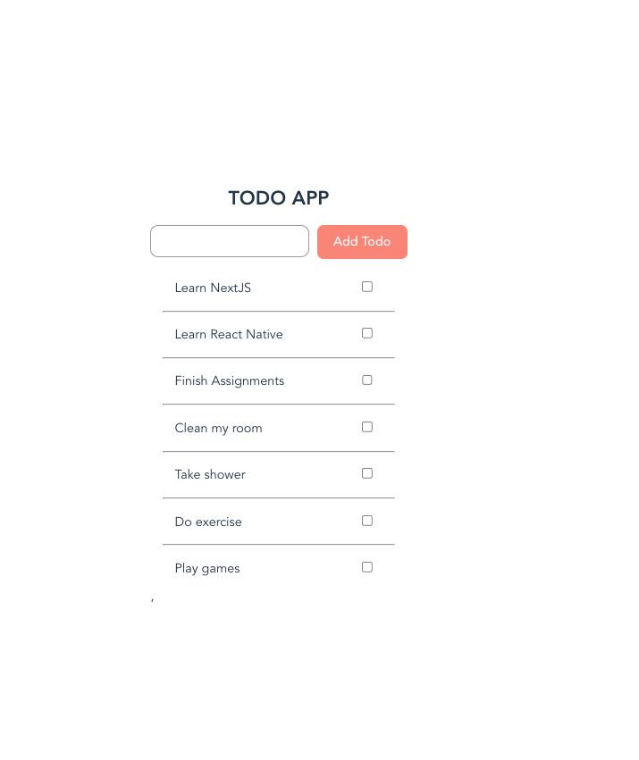
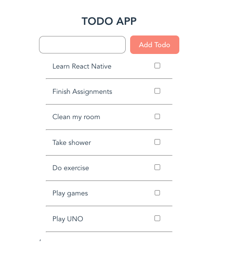
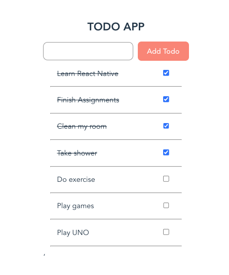
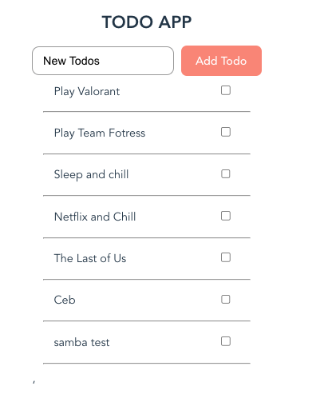

# Simple CRUD Todo App With React Query and Axios

# React-Query-Axios

Simple CRUD Todo App With React Query and Axios

This just for you who currently trying to understanding React-Query, this a simple example how to use React-Query on GET, POST, PUT and DELETE endpoint and integrated with Axios..
On React-Query, for GET endpoint you use useQuery hook, but if your method modifies data on the server (POST, PUT, DELETE, etc), you better use useMutation hook.

# Screen shot

